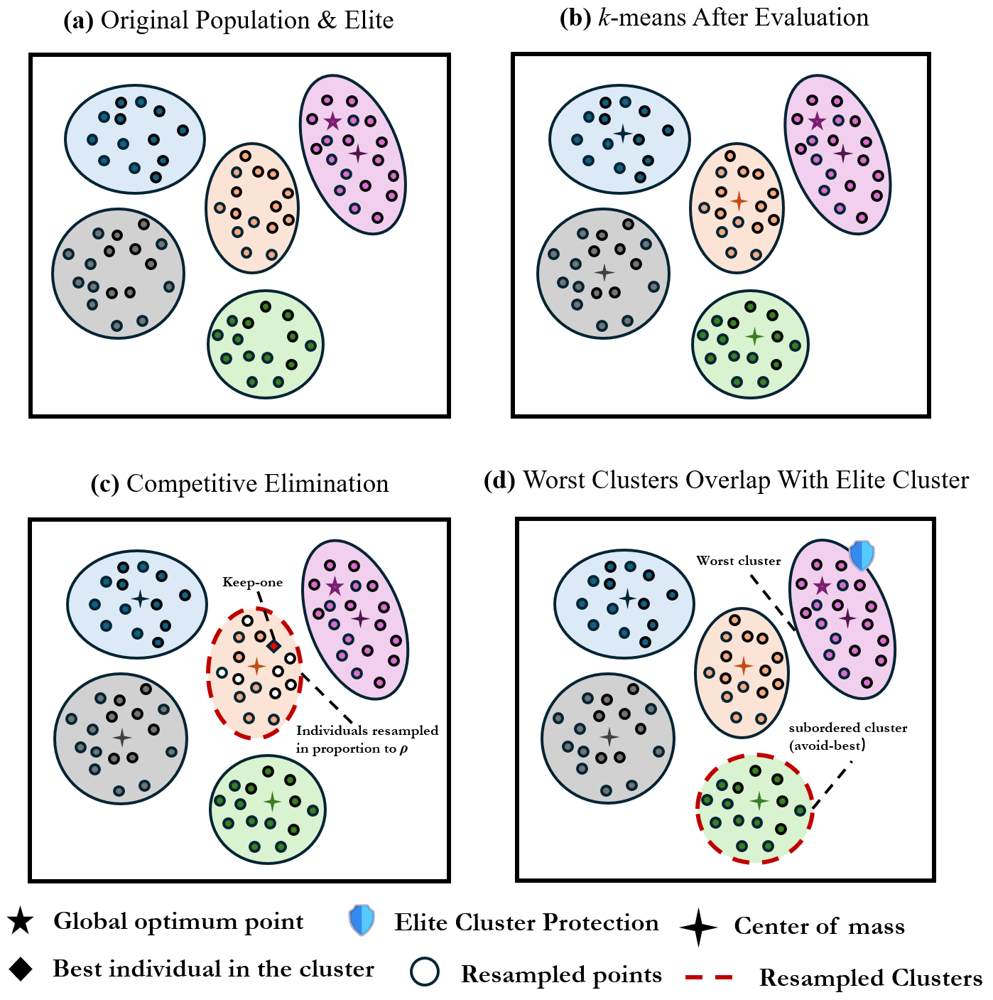
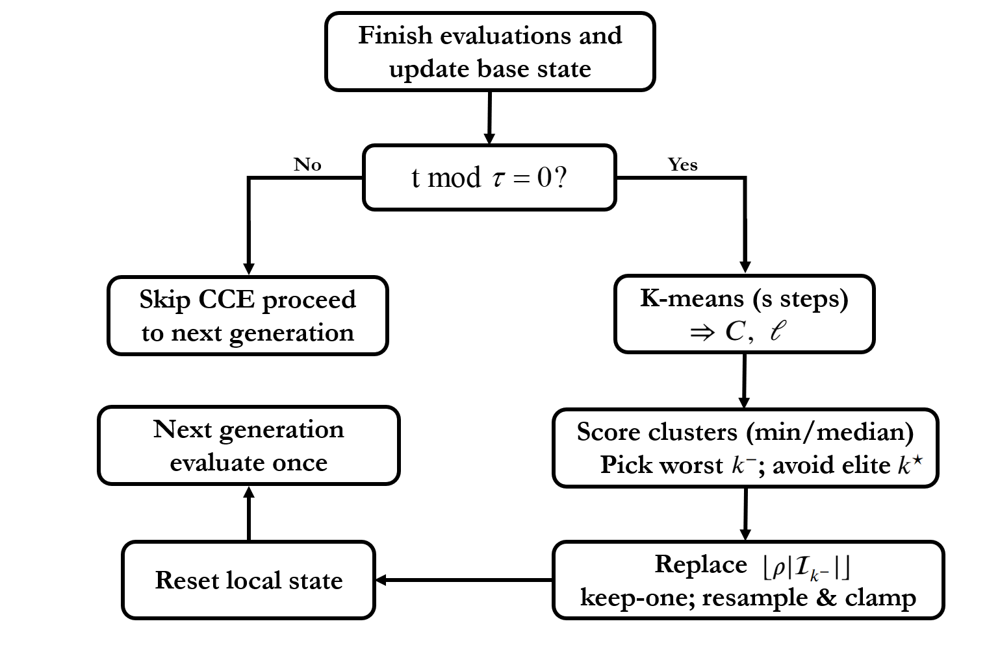

# Competitive Cluster Elimination (CCE)

**A k-means-guided, evaluation-neutral plug-in for large-scale swarm optimization**

[](https://opensource.org/licenses/MIT)
[](https://github.com/junbolian/Competitive-Cluster-Elimination)

## 📚 Overview

Competitive Cluster Elimination (CCE) is a lightweight, evaluation-neutral plug-in mechanism that enhances swarm-based optimizers (PSO, DE, SHADE, JADE) without modifying their native update rules or increasing objective evaluations. By periodically partitioning the population using k-means clustering and selectively refreshing only the worst-scoring cluster while preserving the elite cluster, CCE effectively injects targeted diversity into the search process.

### Key Features
- **Evaluation-neutral**: No additional objective function evaluations
- **Plug-and-play**: Works with PSO, DE, SHADE, and JADE without modifying core algorithms
- **Targeted diversity**: Only resets the worst-performing cluster while protecting the elite
- **Scalable**: O(NKDs) complexity per refresh with negligible overhead
- **Parameter-efficient**: Only two main parameters (τ, ρ) with auto-K option

## 🚀 Quick Start

```matlab
% Example: Using CCE with PSO
params.tau = 2;        % Refresh interval
params.rho = 0.90;     % Replacement ratio  
params.auto_K = true;  % Automatic cluster count
params.s = 5;          % Lloyd iterations

% Run CCEPSO
[best_solution, best_fitness] = CCEPSO(objective_func, bounds, params);
```

## 📂 Repository Structure

The repository contains four main sections corresponding to different experimental chapters:

### Section 2 - Source Code
**Location**: `Section 2-Source code/`

Contains the complete implementation of CCE for all supported algorithms:
- `CCE.m` - Core CCE mechanism implementation
- `CCEPSO.m` - CCE-enhanced Particle Swarm Optimization
- `CCEDE.m` - CCE-enhanced Differential Evolution
- `CCESHADE.m` - CCE-enhanced SHADE algorithm
- `CCEJADE.m` - CCE-enhanced JADE algorithm
- `utils/` - Helper functions for clustering and scoring

### Section 3 - Parameter Sensitivity Analysis
**Location**: `Section 3-parameter sensitive/`

Comprehensive parameter sensitivity study on CEC-2017 benchmark (D=100):
- **Key Data File**: `results_CCE_PSO_CEC2017_D100_compare.mat`
  - Contains complete experimental results for all parameter configurations
  - Grid search: τ ∈ {2, 3, 5}, ρ ∈ {0.30, 0.50, 0.70, 0.90}
  - 29 functions × 20 runs × 12 configurations
  - Includes fitness values, convergence curves, and runtime metrics

### Section 4 - Generalization Tests
**Location**: `Section 4-Compare/`

Cross-algorithm validation and transferability experiments:
- **Key Data File**: `results_GEN_CCE_FIXED_D100.mat`
  - Complete results for DE, SHADE, and JADE with fixed CCE parameters
  - Transfer protocol: parameters tuned on PSO, applied unchanged to other algorithms
  - Performance comparisons on CEC-2017 benchmark suite
  - Statistical analysis with Wilcoxon signed-rank tests

### Section 5 - Applications to NP-hard Problems
**Location**: `Section 5-Applications/`

Real-world applications on combinatorial optimization problems:

#### 0/1 Knapsack Problem
- `knapsack_data/` - Problem instances (P01-P09)
- `knapsack_constraints.txt` - Capacity constraints
- `knapsack_results.mat` - Experimental results

#### Traveling Salesman Problem (TSP)
- `tsp_data/` - TSPLIB instances (ch150, eil76, pr124, pr136, pr144, pr152)
- `tsp_coordinates.txt` - City coordinates
- `tsp_results.mat` - Tour lengths and convergence data

## 📊 Visualizations

### Mechanism Diagram


The mechanism illustrates the four-step CCE process:
1. **Original Population & Elite**: Initial population with global best marked
2. **k-means Clustering**: Partition population into K clusters
3. **Competitive Elimination**: Identify and partially reset worst cluster
4. **Elite Protection**: Safeguard cluster containing global best

### Flowchart


Shows the integration points where CCE hooks into base optimizers without disrupting their native operations.

## 🔬 Experimental Setup

### Benchmark Functions
- **CEC-2017**: 29 test functions at D=100
- **Budget**: 10,000×D function evaluations
- **Population**: N=100 for large-scale problems
- **Runs**: 20-30 independent trials per configuration

### Optimal Parameters (from calibration)
- **τ = 2**: Refresh interval (every 2 generations)
- **ρ = 0.90**: Replacement ratio (90% of worst cluster)
- **K = min(8, ⌈√N⌉)**: Automatic cluster count
- **s = 5**: Lloyd iterations for k-means

## 📈 Key Results

### Performance Improvements
- **CCEPSO**: 24/29 functions improved on CEC-2017
- **CCEJADE**: 69% win rate (20/29 functions)
- **TSP**: 6/6 instances improved for DE/SHADE/JADE
- **Knapsack**: Consistent gains on P06-P09 instances

### Runtime Efficiency
- Negligible overhead for DE and SHADE
- 10-30% speedup on multimodal functions (F6, F9, F10, F23-F25)
- Amortized complexity: O(NKDs/τ) per generation

## 📖 Citation

If you use CCE in your research, please cite:

```bibtex
@article{lian2025cce,
  title={Competitive Cluster Elimination (CCE): k-means-guided, evaluation-neutral plug-in for large-scale swarm optimization},
  author={Lian, Junbo Jacob and Ouyang, Kaichen and Zhang, Yujun and Zhong, Rui and Chen, Haoran and Chen, Huiling and Fukunaga, Alex},
  journal={Swarm and Evolutionary Computation},
  year={2025},
  publisher={Elsevier}
}
```

## 👤 Author

**Junbo Jacob Lian**
- Lead developer and method proposer
- Data organization and manuscript preparation
- Email: jacoblian@u.northwestern.edu
- ORCID: 0000-0001-7602-0022

## 🤝 Contributors

- Kaichen Ouyang - Investigation and validation
- Yujun Zhang - Formal analysis
- Rui Zhong - Validation
- Haoran Chen - Validation
- Huiling Chen - Supervision and funding
- Alex Fukunaga - Supervision and analysis

## 📄 License

This project is licensed under the MIT License - see the [LICENSE](LICENSE) file for details.

## 🙏 Acknowledgments

This research was supported by the National Natural Science Foundation of China (Grant No. 62076185, 62301367).

## 📞 Contact

For questions or collaborations, please open an issue or contact:
- Junbo Jacob Lian: jacoblian@u.northwestern.edu
- Huiling Chen: chenhuiling.jlu@gmail.com

## 🔗 Links

- [Paper](https://github.com/junbolian/Competitive-Cluster-Elimination)
- [Supplementary Materials](https://github.com/junbolian/Competitive-Cluster-Elimination)
- [CEC-2017 Benchmark](http://www.ntu.edu.sg/home/epnsugan/)
- [TSPLIB](http://comopt.ifi.uni-heidelberg.de/software/TSPLIB95/)

---

**Note**: All experimental data, source code, and visualization scripts are available for full reproducibility. Please ensure MATLAB R2020a or later for running the experiments.
